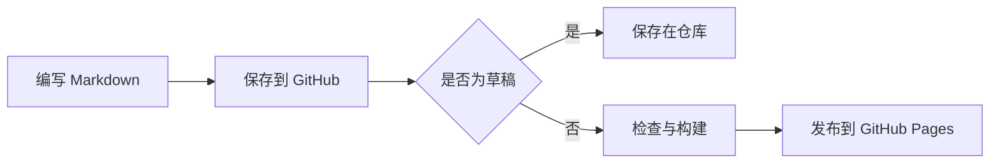
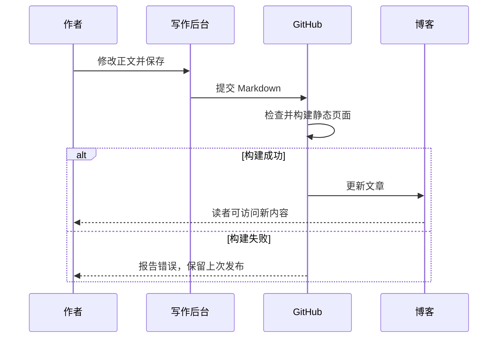
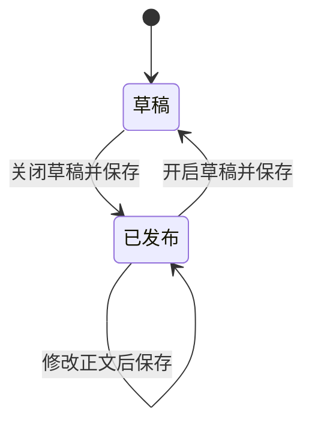
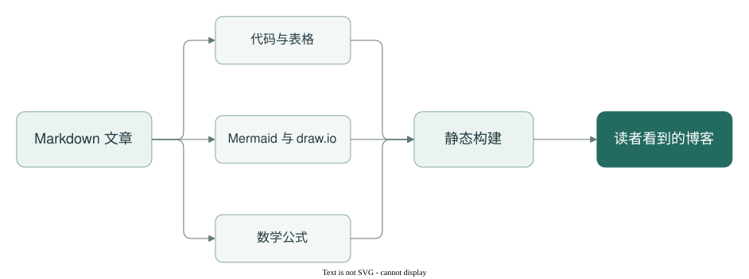

Markdown 并不是一种包含所有功能的万能格式。基础语法之外，还有 GitHub 风格的扩展、数学公式、图表和各家编辑器自己的写法。这篇文章把常见情况放在一起，作为博客的实际渲染样本。

## 先说支持范围

| 写法 | 本博客的处理方式 | 需要留意的地方 |
| :--- | :--- | :--- |
| 标题、强调、列表、链接 | 直接排版 | 不同层级要正确缩进 |
| 表格、任务列表、删除线、脚注 | 按 GitHub 风格扩展处理 | 表格单元格里的竖线需要转义 |
| 带语言名的代码块 | 语法高亮 | 代码只展示，不会执行 |
| Mermaid 代码块 | 发布时生成静态 SVG 图片 | 图表语法错误会阻止发布，需要修正 |
| draw.io 图 | 作为 SVG 或 PNG 图片展示 | `.drawio` XML 源文件本身不是图片 |
| 数学公式 | 使用 KaTeX 排版 | 支持 KaTeX 的公式语法，不是完整 LaTeX 文档 |
| HTML 折叠、上下标、合并单元格 | 使用对应的 HTML 元素 | 页面禁止执行脚本和嵌入 iframe |
| MDX、Obsidian 双链、自定义容器 | 尚未接入 | 不保证按对应编辑器的样式显示 |

## 代码：中文、泛型与特殊字符

### TypeScript

```typescript
type Result<T> =
  | { ok: true; value: T }
  | { ok: false; error: string };

function parseJson<T>(source: string): Result<T> {
  try {
    return { ok: true, value: JSON.parse(source) as T };
  } catch (error) {
    return { ok: false, error: `解析失败：${String(error)}` };
  }
}

const message = '<script>alert("这只是代码文本")</script>';
console.log(parseJson<{ title: string }>('{"title":"温智钧的笔记"}'));
```

这里的 `<script>` 应当原样出现在代码框里，而不是作为网页脚本执行。

### Python 与多行字符串

```python
from collections import Counter

notes = ["Markdown", "图表", "Markdown", "代码"]
for name, count in Counter(notes).most_common():
    print(f"{name}: {count}")

snippet = """第一行：中文与 emoji 📝
第二行：<tag> & \"quotes\" | pipes
第三行：保留换行与缩进"""
```

### 在代码围栏中展示另一段代码围栏

外层使用四个反引号，就可以展示包含三个反引号的 Markdown 源码：

````markdown
```json
{
  "title": "包含代码的文章",
  "draft": false,
  "tags": ["Markdown", "测试"]
}
```
````

## Mermaid：从文字到图表

以下图表直接来自文章里的 `mermaid` 代码块。发布时完成渲染，读者打开文章时不需要再下载 Mermaid 脚本。

### 流程图：一次文章发布



### 时序图：网页写作与自动发布



### 状态图：草稿与发布



## draw.io：图像与源文件各司其职

下面用一个流程图展示代码、图表、公式如何组成一篇文章。网页里引用 SVG 图片，源文件保留为 `.drawio`，便于以后在 draw.io 中继续编辑。

<figure class="diagram" tabindex="0" aria-label="draw.io 文章构建流程图">



</figure>

[下载这张图的 draw.io 源文件](https://raw.githubusercontent.com/oqwn/wzj-blog/main/content/images/markdown-pipeline.drawio)。在 draw.io 中打开后，可以移动节点、修改文字，再导出 SVG 或 PNG。

图片使用普通 Markdown 语法：

```markdown

```

**把原始 `.drawio` 文件直接写进图片链接，或把 XML 粘进代码块，都不会自动变成图。** 图像导出与 Markdown 渲染是两件事。[draw.io 的 SVG 导出说明](https://www.drawio.com/docs/manual/export/export-to-svg/)

## 表格：对齐、转义与单元格里的格式

| 左对齐：功能 | 居中：示例状态 | 右对齐：示例数量 |
| :--- | :---: | ---: |
| **代码高亮** | 已展示 | 3 |
| `A \| B` 里的竖线 | 已转义 | 2 |
| ~~旧格式~~ → 新格式 | 已替换 | 1 |
| [参考链接][astro] 与 `inline code` | 可组合 | 12 |

上面的数字只是排版示例，不是性能测量。原生 Markdown 表格不支持合并单元格；确实需要时，可以使用 HTML：

<table>
  <thead><tr><th>类别</th><th>内容</th><th>展示方式</th></tr></thead>
  <tbody>
    <tr><td rowspan="2">图表</td><td>Mermaid</td><td>代码块生成图片</td></tr>
    <tr><td>draw.io</td><td>引用 SVG 图片</td></tr>
    <tr><td colspan="2">普通 Markdown</td><td>直接排版</td></tr>
  </tbody>
</table>

## 列表：嵌套、任务与引用

1. 准备文章。
   - 写清楚问题与背景。
   - 给出能复现的例子。
     - 输入是什么？
     - 输出是否符合预期？
2. 检查表现。
   - [x] 代码缩进与特殊字符
   - [x] 图表中文与箭头
   - [x] 表格与数学公式
   - [ ] 把所有编辑器的私有语法都当成通用 Markdown
3. 保存并发布。

> 一篇技术笔记可以同时包含文字、代码与图。
>
> **重点是让信息可以被理解和复现。**
>
> > 嵌套引用也应该保持清晰的层级。

## 数学公式：行内与独立公式

行内公式可以写成 $a^2+b^2=c^2$，时间复杂度可以写成 $O(n\log n)$。

独立公式：

$$
\frac{1}{n}\sum_{i=1}^{n}(x_i-\bar{x})^2
\qquad
\begin{bmatrix}
1 & 2 \\
3 & 4
\end{bmatrix}
$$

美元金额在源码中可以转义为 `\$19.99`，显示为 \$19.99，避免被误当成公式起点。

## 一些容易被忽略的边界

### 行内反引号与特殊字符

普通行内代码是 `const value = 1`。内容本身包含反引号时，使用双反引号：`` `name` ``。

这些字符应该按字面显示：\*不是斜体\*、\[不是链接\]、\#不是标题，以及 `a < b && b > c`。正文也可以包含中文标点、English、emoji 🧪、H<sub>2</sub>O 和 x<sup>2</sup>。

### 硬换行

这一行末尾有两个空格。  
这一句应当紧接着换到下一行，而不是另起一个段落。

### 折叠内容

<details>
<summary>展开查看一个嵌套的 Markdown 例子</summary>

折叠区域里也可以有 **加粗文字**、列表和代码：

- 第一项
- 第二项

```bash
npm run build
```

</details>

### 脚注与引用式链接

文章中可以使用脚注[^markdown]，也可以把链接地址统一放在文末，例如 [Astro 文档][astro]。

### 这些写法暂时不承诺支持

下面是源码展示，不是已经接入的功能：

```text
[[另一篇笔记]]              # Obsidian 双链
![[附件.drawio]]            # Obsidian 嵌入
:::warning                 # 某些文档工具的自定义容器
<InteractiveChart />       # MDX / JSX 组件
```

普通 Markdown 中也不执行 JavaScript，不运行代码块里的程序，不加载 iframe 里的外部交互页面。需要新的扩展时，应先增加对应支持，再用样例验证。

## 这次测试说明了什么

这份样本覆盖了常见技术文章的内容组合；它不能证明所有 Markdown 方言、所有 Mermaid 图类型和所有 LaTeX 命令都兼容。之后遇到新的写法，可以把最小例子补进来，再检查构建和最终页面。

在网页后台修改这类文章时，建议使用 **Source** 源码模式。后台的排版视图与博客的渲染器不同，Mermaid、公式和复杂 HTML 的最终效果以发布后的文章为准。

[^markdown]: Markdown 的基础语法与后续扩展需要区分。本博客使用 Astro 的 Markdown 管线，并增加了图表和公式处理。

[astro]: https://docs.astro.build/en/guides/markdown-content/
